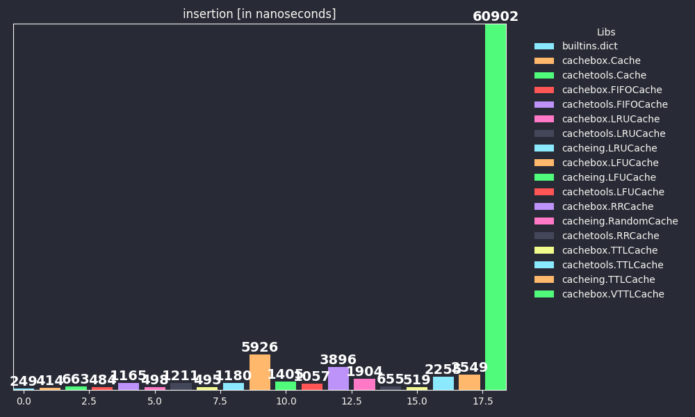
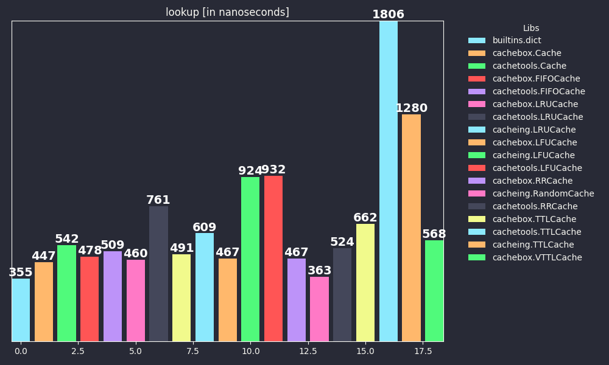
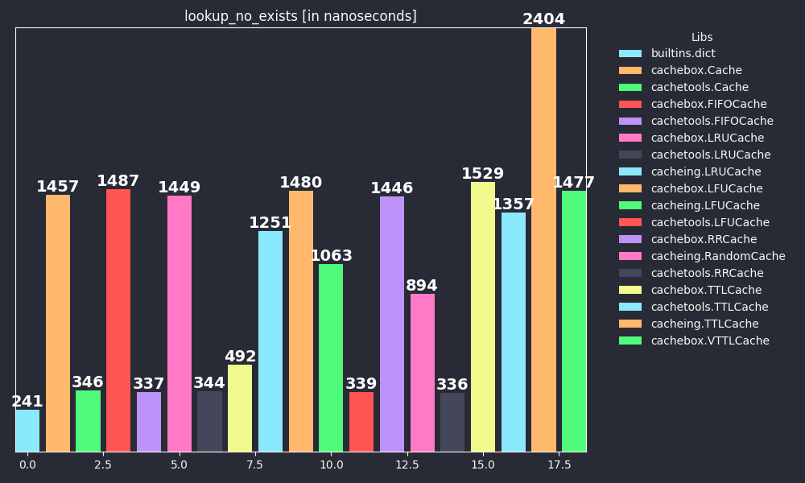
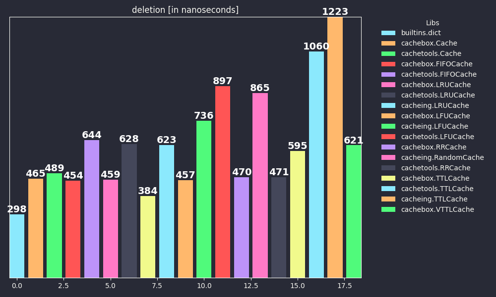
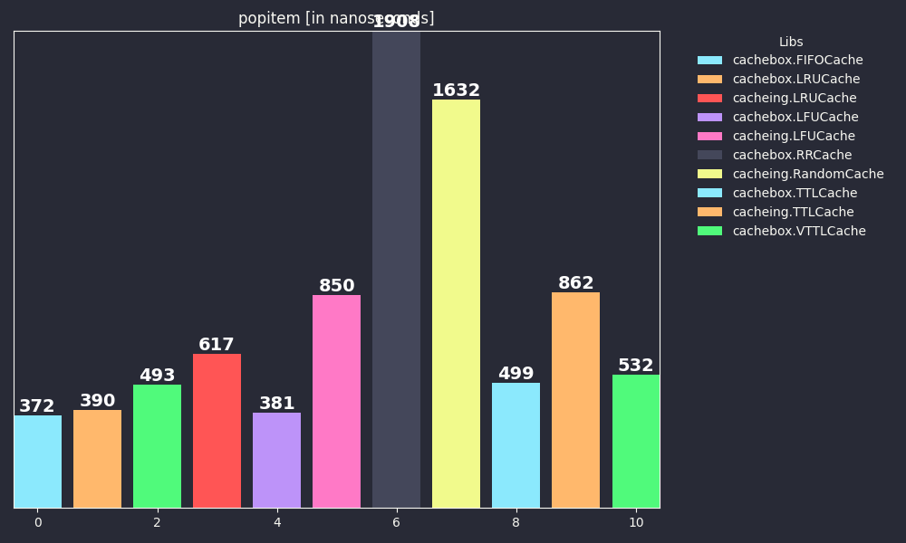
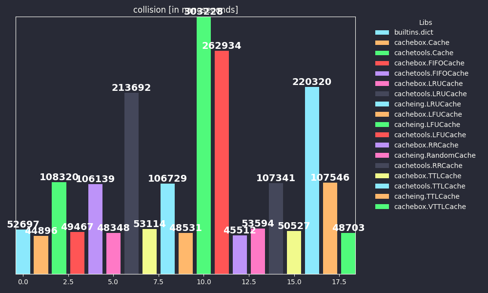

# Caching libraries Benchmarks


According to my new library [cachebox](https://github.com/awolverp/cachebox), I decided to benchmark caching libraries
which are I know, to show the power of [cachebox](https://github.com/awolverp/cachebox) ...

If you know other library, tell me to add it to this page.

> [!NOTE]\
> The system on which the benchmarks are done: Linux-6.12.20-2-MANJARO-x86_64-with-glibc2.41

> [!NOTE]\
> The `cacheing.VTTLCache` class was excluded from the benchmark because of numerous unreasonable errors.
## Benchmarks


**Versions**:
- Python: 3.13.2
- cachebox version: 5.0.0
- cachetools version: 5.5.2
- cacheing version: 0.1.1
- lru-dict: 1.3.0

### insertion




|Name|min (ns)|mean (ns)|max (ns)|stddev (ns)|
| :---: | :---: | :---: | :---: | :---: |
|builtins.dict|196|248|94128|1102|
|cachebox.Cache|358|414|98335|1004|
|cachetools.Cache|568|663|20851|243|
|cachebox.FIFOCache|360|483|50252|380|
|cachetools.FIFOCache|991|1165|211356|2448|
|cachebox.LRUCache|403|497|71116|513|
|cachetools.LRUCache|1024|1210|161687|2133|
|_lru.LRU|339|494|237201|1214|
|cacheing.LRUCache|657|1180|503251|2896|
|cachebox.LFUCache|433|5926|85648|1914|
|cacheing.LFUCache|677|1405|557601|3772|
|cachetools.LFUCache|928|1056|54699|702|
|cachebox.RRCache|346|3895|168087|2434|
|cacheing.RandomCache|586|1903|283889|1920|
|cachetools.RRCache|561|655|19208|239|
|cachebox.TTLCache|422|518|55923|409|
|cachetools.TTLCache|1994|2255|302849|3233|
|cacheing.TTLCache|1707|2549|590998|4524|
|cachebox.VTTLCache|760|60901|201380|32558|

### lookup




|Name|min (ns)|mean (ns)|max (ns)|stddev (ns)|
| :---: | :---: | :---: | :---: | :---: |
|builtins.dict|193|354|9297|202|
|cachebox.Cache|285|447|6459|184|
|cachetools.Cache|350|542|6246|195|
|cachebox.FIFOCache|291|478|8192|219|
|cachetools.FIFOCache|358|508|7424|176|
|cachebox.LRUCache|284|460|7975|209|
|cachetools.LRUCache|589|761|13392|224|
|_lru.LRU|319|490|8750|212|
|cacheing.LRUCache|450|608|9966|233|
|cachebox.LFUCache|277|466|7279|228|
|cacheing.LFUCache|650|924|220181|2251|
|cachetools.LFUCache|697|932|11763|229|
|cachebox.RRCache|299|466|7650|205|
|cacheing.RandomCache|245|362|6671|168|
|cachetools.RRCache|385|523|7737|186|
|cachebox.TTLCache|489|662|9055|216|
|cachetools.TTLCache|1609|1805|21517|274|
|cacheing.TTLCache|1107|1279|13580|199|
|cachebox.VTTLCache|437|568|9194|203|

### lookup_no_exists




|Name|min (ns)|mean (ns)|max (ns)|stddev (ns)|
| :---: | :---: | :---: | :---: | :---: |
|builtins.dict|187|240|2774|91|
|cachebox.Cache|609|1456|15348|1163|
|cachetools.Cache|285|346|5002|97|
|cachebox.FIFOCache|598|1487|13811|1201|
|cachetools.FIFOCache|282|337|3668|96|
|cachebox.LRUCache|581|1449|24187|1214|
|cachetools.LRUCache|290|343|4140|90|
|_lru.LRU|413|492|6555|117|
|cacheing.LRUCache|1110|1250|12334|181|
|cachebox.LFUCache|581|1480|25214|1265|
|cacheing.LFUCache|916|1062|9345|161|
|cachetools.LFUCache|291|339|5445|106|
|cachebox.RRCache|623|1445|15723|1148|
|cacheing.RandomCache|746|893|8416|137|
|cachetools.RRCache|280|336|3295|90|
|cachebox.TTLCache|634|1529|25934|1266|
|cachetools.TTLCache|1211|1356|12476|198|
|cacheing.TTLCache|2205|2403|13889|244|
|cachebox.VTTLCache|594|1477|28185|1265|

### deletion




|Name|min (ns)|mean (ns)|max (ns)|stddev (ns)|
| :---: | :---: | :---: | :---: | :---: |
|builtins.dict|211|298|4560|97|
|cachebox.Cache|348|464|6735|146|
|cachetools.Cache|382|489|4902|114|
|cachebox.FIFOCache|341|454|5428|129|
|cachetools.FIFOCache|508|644|7347|135|
|cachebox.LRUCache|377|459|40563|419|
|cachetools.LRUCache|497|627|6751|130|
|_lru.LRU|276|384|3598|111|
|cacheing.LRUCache|486|622|8737|144|
|cachebox.LFUCache|362|457|92501|928|
|cacheing.LFUCache|556|736|15637|228|
|cachetools.LFUCache|755|897|10537|144|
|cachebox.RRCache|356|470|5553|156|
|cacheing.RandomCache|636|864|9781|194|
|cachetools.RRCache|387|471|5645|98|
|cachebox.TTLCache|474|595|7983|140|
|cachetools.TTLCache|878|1059|59041|729|
|cacheing.TTLCache|978|1223|43007|632|
|cachebox.VTTLCache|496|621|68773|698|

### popitem




|Name|min (ns)|mean (ns)|max (ns)|stddev (ns)|
| :---: | :---: | :---: | :---: | :---: |
|cachebox.FIFOCache|292|371|7362|138|
|cachebox.LRUCache|309|390|10831|171|
|_lru.LRU|342|492|4676|193|
|cacheing.LRUCache|527|617|45496|465|
|cachebox.LFUCache|316|381|99141|990|
|cacheing.LFUCache|718|849|10476|147|
|cachebox.RRCache|370|1907|8932|1202|
|cacheing.RandomCache|1141|1632|25599|531|
|cachebox.TTLCache|431|498|9836|125|
|cacheing.TTLCache|713|862|12449|239|
|cachebox.VTTLCache|440|531|76785|770|

### collision




|Name|min (ns)|mean (ns)|max (ns)|stddev (ns)|
| :---: | :---: | :---: | :---: | :---: |
|builtins.dict|551|52697|120837|30285|
|cachebox.Cache|558|44896|163363|25902|
|cachetools.Cache|939|108320|356462|62344|
|cachebox.FIFOCache|547|49466|103137|28578|
|cachetools.FIFOCache|958|106138|246686|60913|
|cachebox.LRUCache|527|48347|114290|28348|
|cachetools.LRUCache|1613|213691|437667|122740|
|_lru.LRU|653|53113|176793|30383|
|cacheing.LRUCache|1153|106729|327446|61183|
|cachebox.LFUCache|531|48530|123115|28493|
|cacheing.LFUCache|1867|303228|174298351|1802518|
|cachetools.LFUCache|1783|262934|534687|151162|
|cachebox.RRCache|557|45512|133681|26228|
|cacheing.RandomCache|687|53594|177470|30848|
|cachetools.RRCache|1017|107341|288281|61636|
|cachebox.TTLCache|786|50526|148786|29298|
|cachetools.TTLCache|2672|220319|453406|126383|
|cacheing.TTLCache|1828|107545|249455|61335|
|cachebox.VTTLCache|726|48703|152847|28352|

## Run for yourself


Clone repository with **git** (or download it from here):
```bash
git clone https://github.com/awolverp/cachebox-benchmark
```

Install requirements:
```bash
pip3 install -U -r requiremenets.txt
```

Run benchmark:
```bash
python3 main.py
```