# Caching libraries Benchmarks
According to my new library [cachebox](https://github.com/awolverp/cachebox), I decided to benchmark caching libraries
which are I know, to show the power of [cachebox](https://github.com/awolverp/cachebox) ...

If you know other library, tell me to add it to this page.

> [!NOTE]\
> The system on which the benchmarks are done: **Manjaro Linux x86_64, 8G, Intel i3-1115G4**

## Benchmarks:
**Versions**:
- Python: 3.12.6
- cachebox version: 4.2.3
- cachetools version: 5.5.0
- cacheing version: 0.1.1
- lru-dict: 1.3.0

## Cache


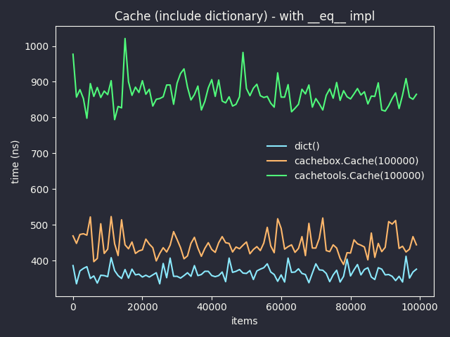

## FIFOCache

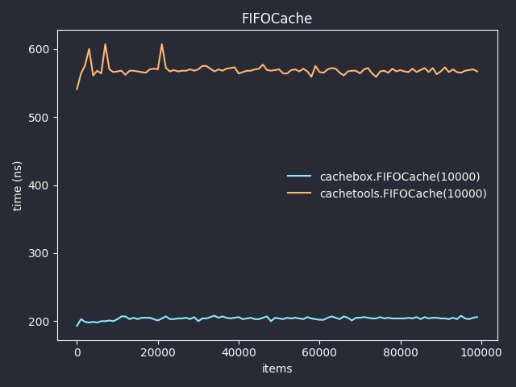

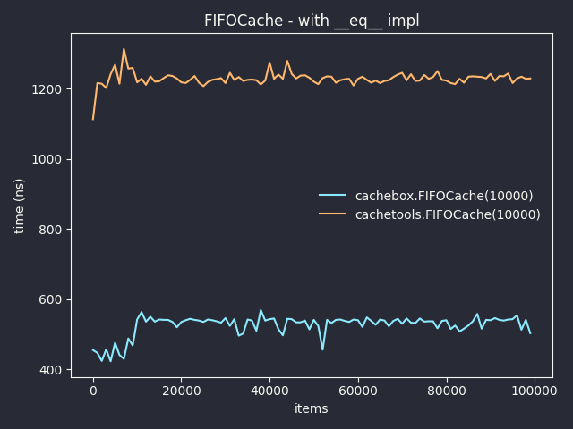

## LFUCache

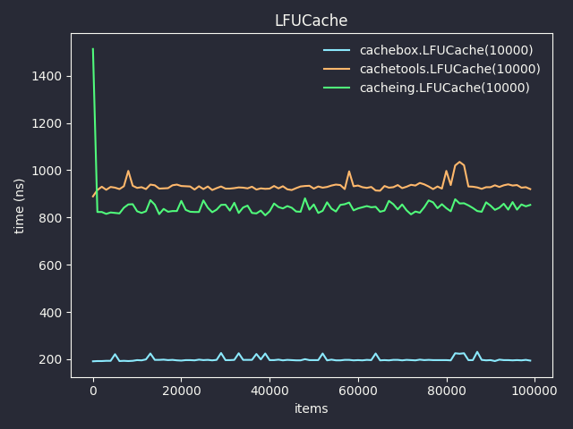

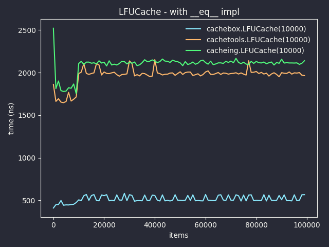

## LRUCache

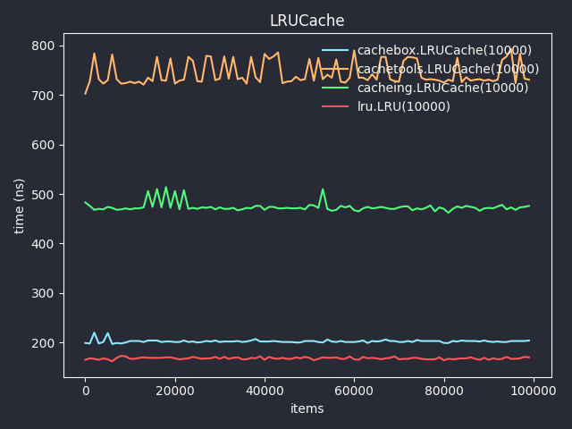

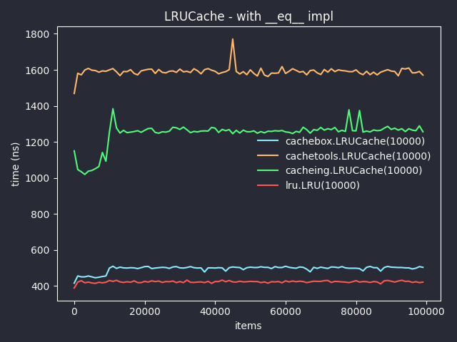

## RRCache

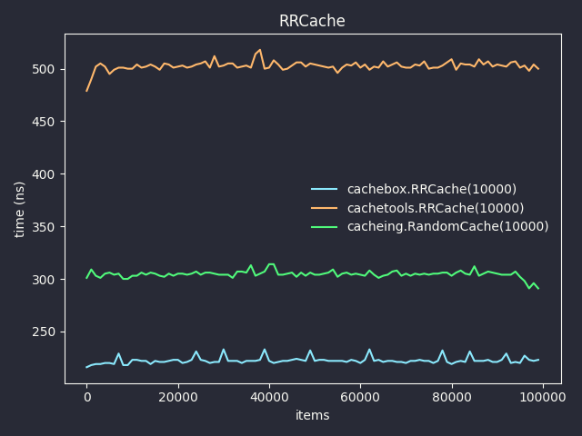

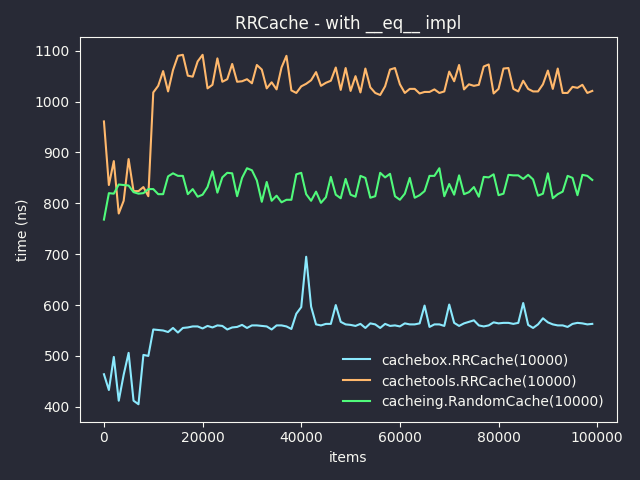

## TTLCache


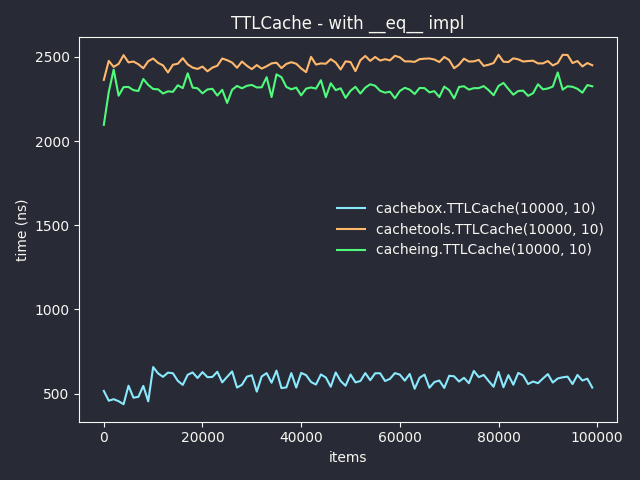

## VTTLCache

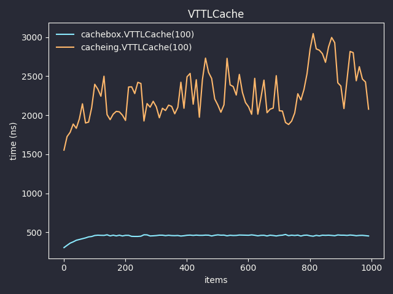

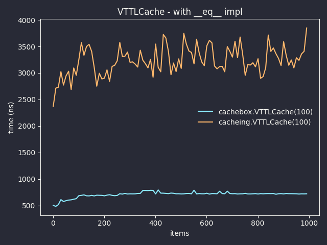

# Run for yourself
Clone repository with **git** (or download it from here):
```bash
git clone https://github.com/awolverp/cachebox-benchmark
```

Install requirements:
```bash
pip3 install -U -r requiremenets.txt
```

Run benchmark:
```bash
python3 main.py
```
